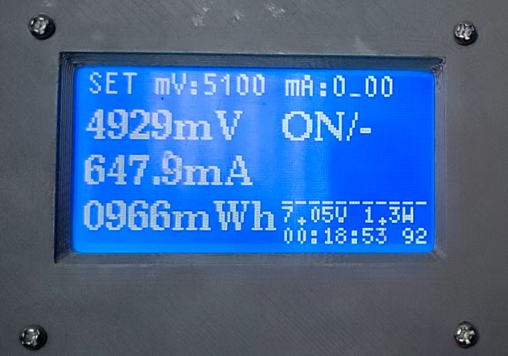

# Digital-wireless-bench-power-supply

Prototype of a small simple liniear bench power supply for suppling electronics circuits. Can measure current with resoultion 0.1mA, does not produce big noise/ripples like dc-dc supply, has simple current oscilloscope. Power by 2S 18650 battery. Work in progress.

Regulator: LM317
MCU: STM32f103c8
Volatge output: 1V3 - 6V
Current output: 0 - 1.2A

